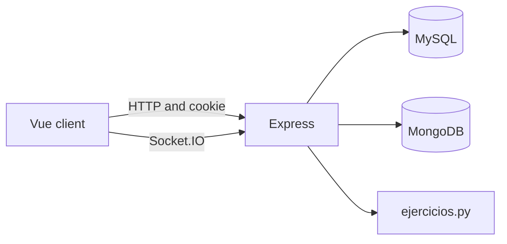

# Math Thai

Math Thai is a game for practising maths, styled as a muay thai fight. A student trains alone, levels up with the experience they earn, and can face another player in a turn-based battle.

The interface is in Catalan. The data has two roles: student and teacher. A student signs in, joins a classroom with a code, and sees that class on their profile. The teacher exists as the owner of the classroom; the app does not yet have a screen of its own for them.

## What a student can do

**Training.** Pick a topic and an activity. Each activity is a sequence of questions. A correct answer grants experience, and the profile updates level and health.

**Battle.** Create a room or join an open one, pick a team, and the owner starts the match. Both teams share a health bar. A correct answer damages the opponent. Rooms live in memory while the server is running: if the process restarts, open matches disappear.

**Profile.** Shows name, rank, level, health, experience, the classroom (name, student count, and teacher), and a history of exercises and battles.

## The six question formats

Each question declares a `formato`. The game screen picks the component from that value.

| Format | What the student does |
|---|---|
| Seleccionar | Chooses one option |
| Unir valores | Matches items from two columns |
| Respuesta | Types the result |
| Imagen | Picks the right figure |
| Ordenar valores | Places the tiles in the requested order |
| Grafica | Marks two points; the game checks whether they draw the line |

The correct answer is not sent with the training prompt. The server checks it (or, in the demo, the in-browser module).

## How it is split

The client is a Vue 3 app with Vuetify, Pinia, and Vue Router. The server is Express, and the same session cookie covers HTTP requests and Socket.IO.

Data lives in two databases:

- **MySQL** stores people and progression: students, teachers, classrooms, levels, and the health tied to each level.
- **MongoDB** stores content and what happens in the game: topics, activities, questions, results, history, and finished battles.

Real battle questions do not come from Mongo. The server runs `ejercicios.py`, which builds a prompt on the fly. Training does read the activities and questions stored in Mongo.

## Demo

A demo mode shows the game without databases or a server. The browser answers with users, a classroom, one exercise that walks through all six formats, and a battle against a bot. That mode does not replace a match between two people: multiplayer still depends on Express and Socket.IO.
